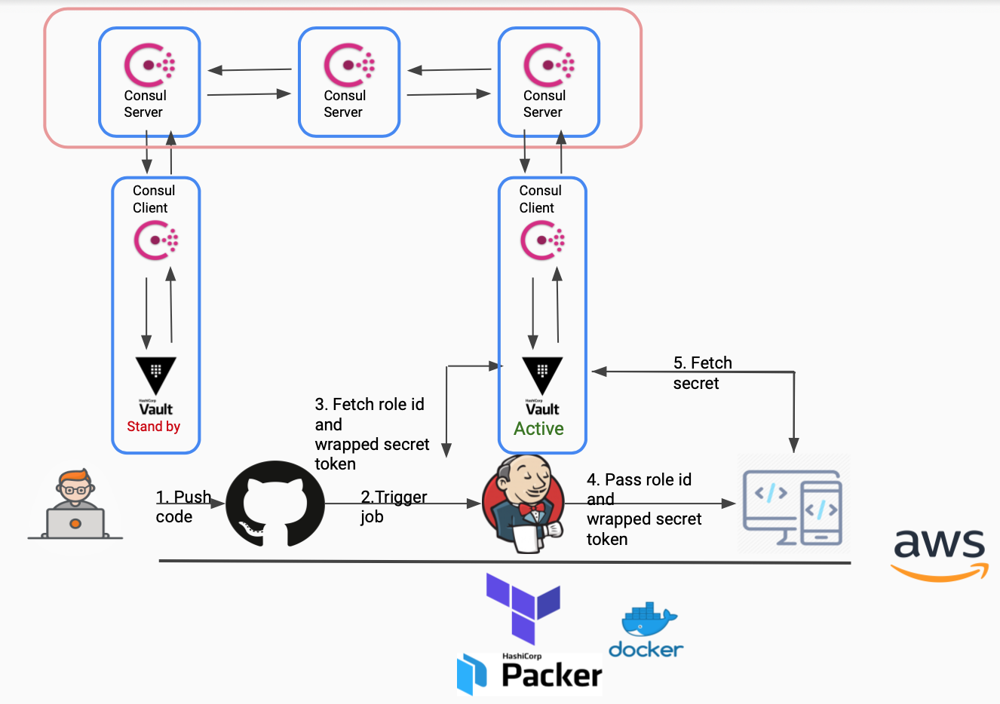

# Vault Secret

This project integrates Vault and Jenkins to build a high availability infrastructure and automation pipeline to secure sensitive information.

In the diagram below, the operator creates a role and attach with a policy that only allows fetch specific secret. Then a developer triggers a build for the application by pushing code to the git repository. Jenkins can now fetch the Role ID and Wrapped Secret Token from Vault. After Jenkins build and test the applicatin successfully, it pass the Role ID and Wrapped Secret Token to the application. The application then use the Role ID and Wrapped Secret Token to fetch the secret from Vault, then start the application.

More instructions can be referred on my [note](note.md).

# Infrastructure

